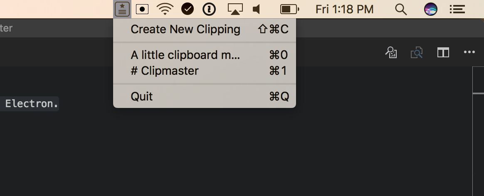

# Clipmaster

A little clipboard manager built in Electron. Clipmaster saves text from your clipboard for later use.

Here is a link to a branch with the [completed example](https://github.com/electron-in-action/clipmaster/tree/completed-example).

# Global Shortcuts

- <kbd>⌘⌥C</kbd>: activate Clipmaster
- <kbd>⌘⌥⇧C</kbd>: save a new clipping to Clipmaster
